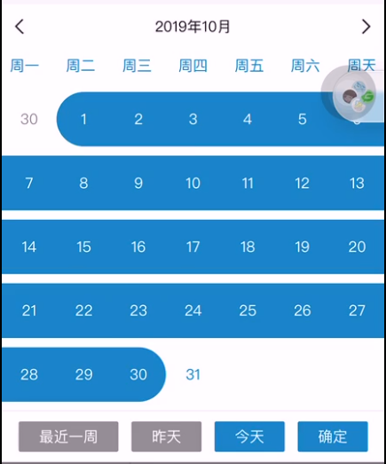

<!--
 * @Author: HuMwing
 * @since: 2019-11-06 12:10:19
 * @lastTime: 2019-11-13 11:30:49
 * @LastAuthor: HuMwing
 * @message: 
 -->
# 小程序日期选择器

> 支持单选和时间段选择，可以拖动选择日期


## 使用效果




## 使用方法

1. 安装 datepicker

```bash
npm install --save @humwing/mp-datepicker
```


2. 在需要使用 datepicker 的页面 page.json 中添加 datepicker 自定义组件配置

```json
{
  "usingComponents": {
    "datepicker": "@humwing/mp-datepicker"
  }
}
```

3. WXML 文件中引用 datepicker

``` xml
<datepicker bindchange="bindChange"/>
```